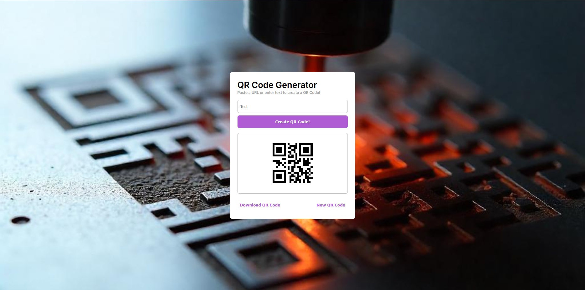

<h1 align="center"> QR Code Generator </h1>

[QrCodeGenerator - Click here](https://thiagotorresferrao.github.io/qrcodeGenerator/)

The QR Code Generator project generates personalized QR codes from text and allows the user to download the QR code as a PNG file. This tool makes it easy and fast to create custom QR codes that can be used for various purposes, such as sharing information at events or printing on business cards. The interface is intuitive and user-friendly, making the creation of personalized QR codes a simple task. In summary, QR Code Generator is a practical solution for anyone who needs to create custom QR codes quickly and efficiently.
 

  <a href="#-tecnologias">Technologies</a>&nbsp;&nbsp;&nbsp;|&nbsp;&nbsp;&nbsp;
  <a href="#-projeto">Project</a>

 

  

## 🚀 Technologies

This project was developed with the following technologies:

  
  
  

## 💻 Project
QR Code Generator is a simple and efficient tool that generates personalized QR codes from text and allows downloading in PNG format for use in various purposes.

- [Online Project!](Link aqui do projeto)

## 🤝 Collaborators

## :dart: Project status
* Concluded! :ballot_box_with_check:

Feito por Thiago Sousa
LinkedIn • Portfólio
📄 Licença | License

This project is open for educational and non-commercial use.

## 🌐 Connect with me

  
  
  
  

